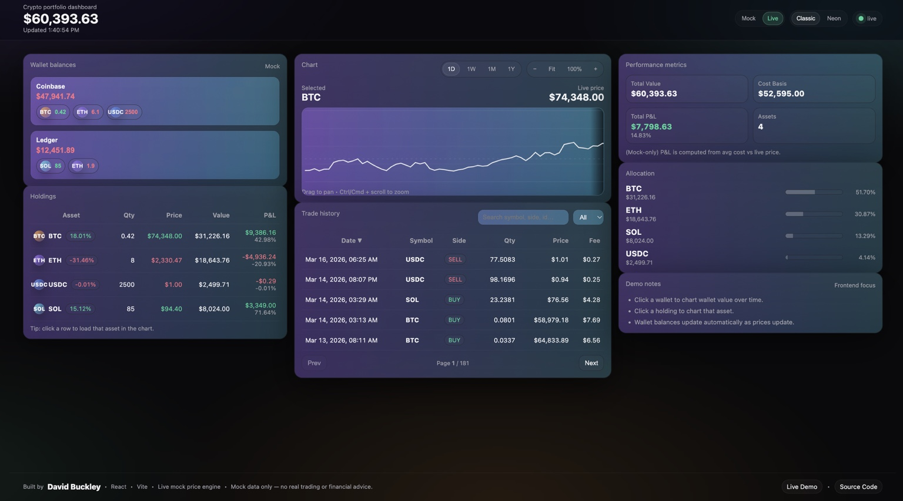

# Crypto Portfolio Dashboard

An interactive **cryptocurrency portfolio analytics dashboard** built with **React and Vite**, designed to showcase advanced frontend engineering and data visualization capabilities.

**Live Demo**
https://crypto-dashboard-three-eta.vercel.app/

---

## Overview

This application simulates a modern **financial analytics dashboard** similar to platforms like Coinbase or Robinhood. It allows users to visualize wallet balances, track asset performance, analyze portfolio allocation, and explore price history through interactive charts.

The project demonstrates advanced frontend engineering concepts including:

- React component architecture
- API integration
- Real-time UI updates
- Data visualization
- Advanced CSS UI systems
- Responsive dashboard layouts

---

## Features

### Portfolio Analytics

- Wallet balance tracking
- Real-time asset valuation
- Portfolio allocation breakdown
- Performance metrics

### Interactive Price Charts

- Zoomable and scrollable chart
- Multi-range views:
  - 1 Day
  - 1 Week
  - 1 Month
  - 1 Year
- Dynamic tooltips displaying:
  - Date
  - Time
  - Price

### Live + Mock Data Modes

**Live Mode**
- Pulls cryptocurrency prices using the CoinGecko API

**Mock Mode**
- Simulates live market price movement for development and demo purposes

### Interactive Dashboard

- Click a wallet to update the price chart
- Click an asset to view its performance
- Automatic recalculation of wallet values when prices change

### Advanced UI System

- Glass-morphism card interface
- Animated aurora background
- Smooth UI micro-interactions
- Price update animations
- Premium financial dashboard styling

### Responsive Layout

- Three-column analytics layout
- Optimized for large desktop displays
- Adaptive behavior for smaller screens

---

## Technology Stack

### Frontend

- React
- JavaScript (ES6+)
- Vite

### Data & APIs

- CoinGecko API
- Mock market simulation engine

### Styling

- Advanced CSS
- Glass UI design
- Animated gradients
- Micro-interaction animations

### Deployment

- Vercel

---

## Project Structure

src/
  components/
    WalletBalances.jsx
    HoldingsTable.jsx
    PricePanel.jsx
    PerformancePanel.jsx
    AllocationList.jsx
    TradeHistoryTable.jsx
    LiveDot.jsx

  hooks/
    useMockLivePrices.js

  lib/
    metrics.js
    mockSeries.js
    utils.js

  data/
    mockData.js

App.jsx
styles.css

---

## Screenshots

Add a screenshot of the dashboard to give viewers a quick visual overview.

Example folder structure:

screenshots/
  dashboard.png

Then add this to the README:

---

## Running the Project

Install dependencies

npm install

Run development server

npm run dev

Build production version

npm run build

---

## Purpose

This project was created to demonstrate **frontend engineering skills for modern fintech applications**, including:

- Data-driven UI development
- Financial dashboard design
- Interactive data visualization
- Advanced CSS interface systems

---

## Author

**David Buckley**

GitHub
https://github.com/dbuckley023

Live Demo
https://crypto-dashboard-three-eta.vercel.app/
